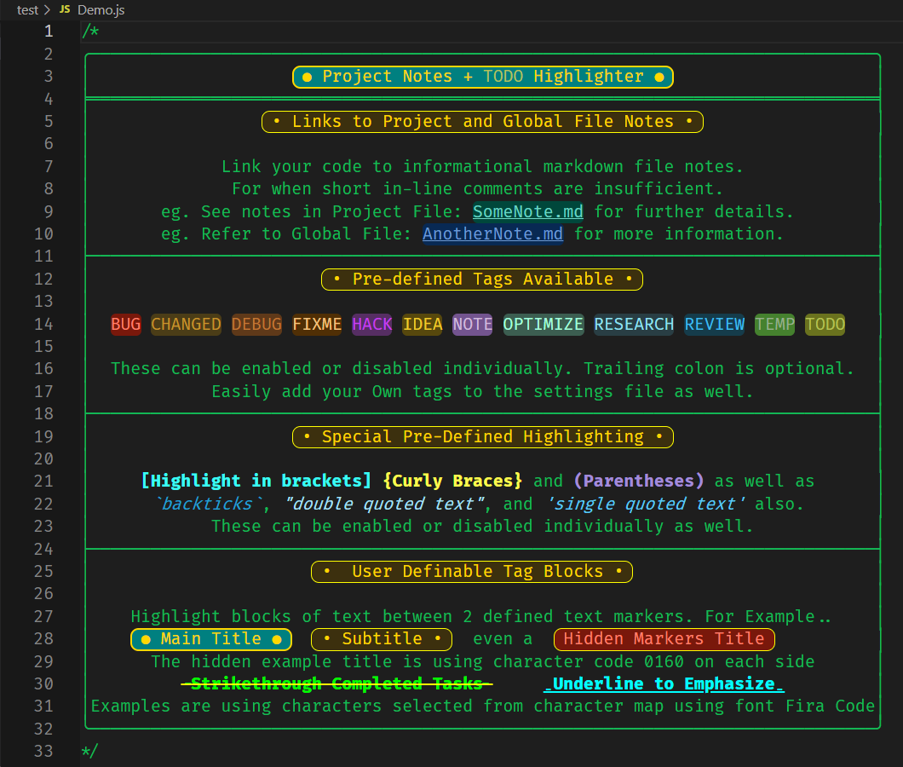
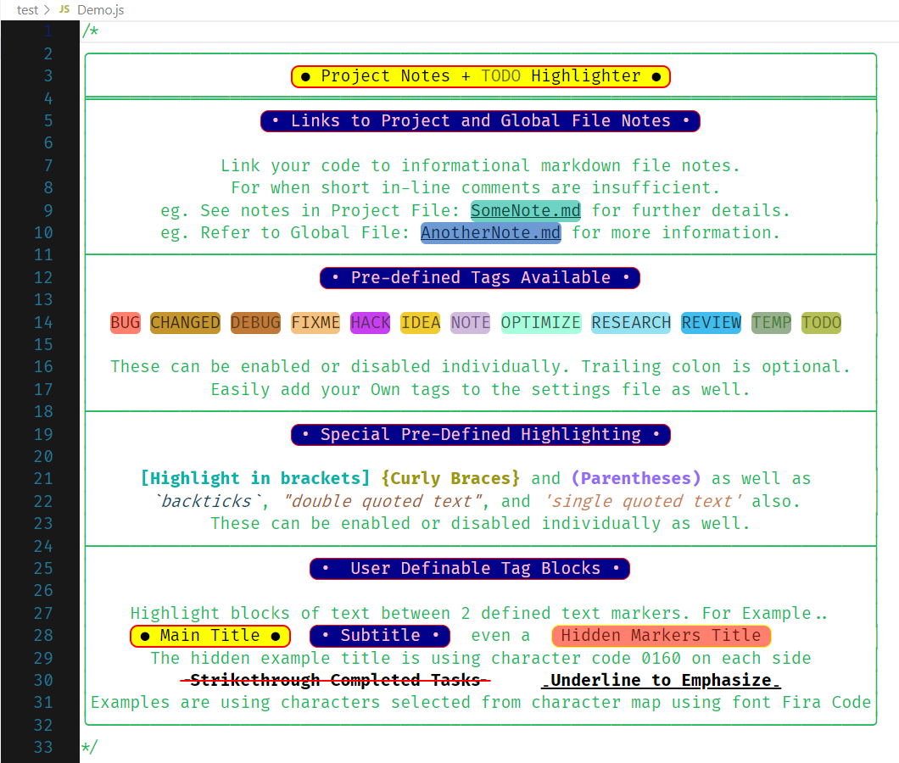

# Project Notes + TODO Highlighter

Important!!! For users that are upgrading from v0.0.5 or earlier please see [Upgrading Notes File](UPGRADING.md) for important information regarding changes from the older versions..

Adds inline file links to notes in markdown files.

Adds TODO syntax highlighting support to comments in your source files.

Note: This extension provides syntax highlighting for definable keywords within your source code. The highlighting is enabled by file extension. It has support for the following languages by file extension...

`.asm .bas .bat .c .c++ .cc .cls .cmd .coffee .cp .cpp .cppm .cs .css .cxx .dpr .go .html .ini .ixx .java .js .jsonc .jsx .kt .kts .ktm .less .m .mat .md .pas .pl .php .py .r .rlib .rs .rb .scss .sql .swift .tbs .ts .twig .txs .vue`

It is possible to [add new extensions](SETTINGS.md) to the settings file. If you are using a programming language that this extension does not support and you need assistance adding it to the settings file, please submit an issue on my [Github Issues page](https://github.com/willasm/project-notes/issues) and I will add support for it to this extension.

## Features
- Link to project note files in Markdown format.
- Link to global note files in Markdown format.
- Adds syntax highlighting in comments to the default tags `BUG, CHANGED, DEBUG, FIXME, HACK, IDEA, NOTE, OPTIMIZE, RESEARCH, REVIEW, TEMP and TODO`.
- Supports Light and Dark Themes.
- All `Tags` can be enabled or disabled individually in the [settings](SETTINGS.md) file.
- Highlighting of user definable `Tag Blocks` - Any text surrounded by user definable text characters.
- [Snippets](#snippets-for-pre-defined-tag-blocks) for the pre-defined tag blocks
- New `Tags` can be added to the settings file.
- `Tags` are case insensitive.
- `Tags` trailing colon is optional.
- `Parentheses`, `brackets` and `Curly braces` in comments are also highlighed.
- `Backticks`, `"Double Quotes"` and `'Single Quotes'` in comments are also highlighted.

## Screenshots
Example Highlighting Dark Theme (Dark+ default dark)....

Example Highlighting Light Theme (Light+ default light) ....

## Extension Commands
These commands availiable from the command pallette: (Windows: CTRL+Shift+P or F1) (Mac: CMD+Shift+P)
- `Project Notes: Open or Create Project Note`

    Opens or Creates a Project Note File from a Comment File Link. [See Using File Links](#using-file-links)
- `Project Notes: Open Existing Project Note (Edit Mode)`

    Opens an Existing Project Note File in Edit Mode.
- `Project Notes: Open Existing Project Note (Preview Mode)`

    Opens an Existing Project Note File in Preview Mode.

- `Project Notes: Set Globals Notes Folder Location`

    Set Globals Notes Folder Location
- `Project Notes: Open or Create Global Note`

    Opens or Creates a Global Note File from a Comment File Link. [See Using File Links](#using-file-links)
- `Project Notes: Open Existing Global Note (Edit Mode)`

    Opens an Existing Global Note File in Edit Mode.
- `Project Notes: Open Existing Global Note (Preview Mode)`

    Opens an Existing Global Note File in Preview Mode.

- `Project Notes: Edit Tags Settings File`

    Opens Settings File for editing.

- `Project Notes: Restore Tag Settings File`

    Restores settings file to its default settings. (Caution! This will remove all changes you have made!)

If you plan to use any of the commands regularily it is recommended that you set a default key binding for the command.

## Using File Links
Create a comment in the format `// Project File: Filename.MD` for project notes. The `Project File:` portion is the trigger for highlighting the following file name.

Create a comment in the format `// Global File: Filename.MD` for global notes. The `Global File:` portion is the trigger for highlighting the following file name.

Note that the `MD` extension is required. The file name is styled as underlined by default. Note that it is not an actual clickable link. Unfortunatly it is not possible to receive mouse click messages from vscode.

To create (or open an existing project note) simply run the command `Project Notes: Open or Create Note` with the cursor anywhere on the same line as the `Project File: Filename.MD` comment. If the file already exists it will be opened in a new editor window, otherwise a new file is created and opened for editing. Running the command with the cursor on any line without a `Project File: filename.MD` comment will create (or open) a file with the base name of the current folder opened in VSCode. (Typically your projects name).

To create (or open an existing global note) simply run the command `Project Notes: Open or Create Global Note` with the cursor anywhere on the same line as the `Global File: Filename.MD` comment. If the file already exists it will be opened in a new editor window, otherwise a new file is created and opened for editing. Running the command with the cursor on any line without a `Global File: filename.MD` comment will prompt you for a file name of the global note to open or create.

All Project Note Files are stored in your projects `.vscode` folder (which is created if it does not exist). You may want to add to your `.gitignore` file `.vscode/*.MD` if you do not want Git to track your notes.

## Changing TAG Colors and Styling

Refer to the [settings file documentation](SETTINGS.md)

## Snippets for pre-defined tag blocks
Snippets are provided for the pre-defined tag blocks. They can be entered by typing the prefixes...
Note: To enable snippets selection menu in comments, add this line to your settings.json file.
"editor.quickSuggestions.comments": true

- `tagmaintitle`
- `tagsubtitle`
- `taghiddentitle`
- `tagunderline`
- `tagstrikethrough`

Here is an example...

## Known Issues
In a case like this...

`results = await vscode.workspace.findFiles('**/.vscode/*.{md,MD,mD,Md}',null,500);`

the `/*` in the quoted string will trigger the start of a comment and all following code will highlighted as if it was in a comment until it finds a closing `*/`. Until I resolve this, if you happen to have this occur in your code an easy work around is to force it closed by appending the closing comment characters like this...

`results = await vscode.workspace.findFiles('**/.vscode/*.{md,MD,mD,Md}',null,500);//*/`

## Release Notes
See the [Release Notes](RELEASE.md) for details.

