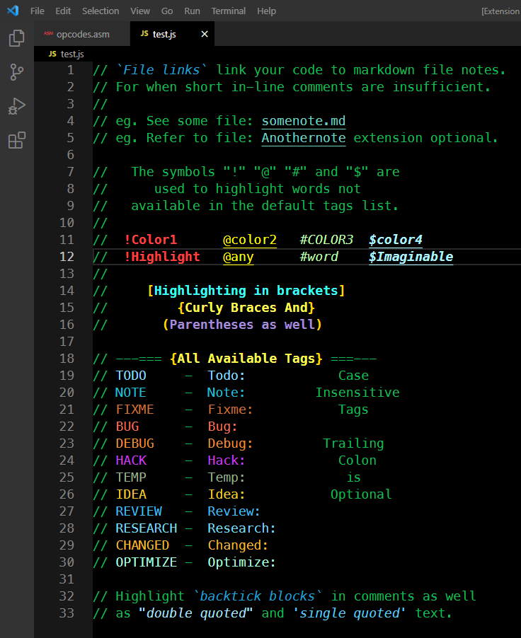

# Project Notes + TODO Highlighter
Adds inline file links to notes in markdown files.

Adds TODO syntax highlighting support to comments in your source files.

Note: This extension should work with any programming language that supports comments. It has been tested with the following languages by file extension...

`asm bat cmd coffee css go html ini js jsx less md php py rb scss ts tbs tsx vue`

If you are using a programming language that this extension does not work with please submit an issue on my [Github Issues page](https://github.com/willasm/project-notes/issues) and I will add it to this extension.

## Features
- Link to project note files in Markdown format.
- Adds syntax highlighting in comments to the tags `TODO, NOTE, FIXME, BUG, DEBUG, HACK, TEMP, IDEA, REVIEW, RESEARCH, CHANGED, and OPTIMIZE`.
- Using the symbols - `!  @  #  $` before any word will allow you to highlight that word. This allows you to highlight words not in the list of supplied `Tags`.
- `Tags` are case insensitive.
- `Tags` trailing colon is optional.
- Comments in Parentheses, brackets and Curly braces are also highlighed.
- Comments in Backticks are also highlighted.


## Screenshots
Example Highlighting ....



## Requirements
The requirement to manually add the `"textMateRules"` section to your settings.json file was removed in v0-0-4. This is now only required if you wish to change the default colors and styling of the tags. To change the colors and styling of the tags you will need to add to your `settings.json` file the settings found in [addtosettings.txt](./resources/addtosettings.txt). Just copy and paste them into your settings.json file. See [Changing TAG Colors and Styling](#changing-tag-colors-and-styling) for in depth explanation of how to change the colors and styling of the tags.

## Extension Commands
These commands availiable from the command pallette: (Windows: CTRL+Shift+P or F1) (Mac: CMD+Shift+P)
- `Project Notes: Open or Create Note`

    Opens or Creates a Project Note File from a Comment File Link. [See Using File Links](#using-file-links)
- `Project Notes: Open Existing Note (Edit Mode)`

    Opens an Existing Project Note File in Edit Mode.
- `Project Notes: Open Existing Note (Preview Mode)`

    Opens an Existing Project Note File in Preview Mode.

- `Project Notes: Set Globals Notes Folder Location`

    Set Globals Notes Folder Location
- `Project Notes: Open or Create Global Note`

    Opens or Creates a Global Note File from a Comment File Link. [See Using File Links](#using-file-links)
- `Project Notes: Open Existing Global Note (Edit Mode)`

    Opens an Existing Global Note File in Edit Mode.
- `Project Notes: Open Existing Global Note (Preview Mode)`

    Opens an Existing Global Note File in Preview Mode.

If you plan to use the File Link feature quite often it is recommended that you set a default key binding for the command.


## Using File Links
Create a comment in the format `// File: Filename.MD` for project notes. The `File:` portion is the trigger for highlighting the following file name.

Create a comment in the format `// Global File: Filename.MD` for global notes. The `Global File:` portion is the trigger for highlighting the following file name.

Note that the `MD` extension is optional. The file name is styled as underlined by default (Note that it is not an actual clickable link).

To create (or open an existing project note) simply run the command `Project Notes: Open or Create Note` with the cursor anywhere on the same line as the `File: Filename.MD` comment. If the file already exists it will be opened in a new editor window, otherwise a new file is created and opened for editing. Running the command with the cursor on any line without a `File: {filename}.MD` comment will create (or open) a file with the base name of the folder opened in VSCode. (Typically your projects name).

To create (or open an existing global note) simply run the command `Project Notes: Open or Create Global Note` with the cursor anywhere on the same line as the `Global File: Filename.MD` comment. If the file already exists it will be opened in a new editor window, otherwise a new file is created and opened for editing. Running the command with the cursor on any line without a `Global File: {filename}.MD` comment will prompt you for a file name of the global note to open or create.

All Project Note Files are stored in your projects `.vscode` folder (which is created if it does not exist). You may want to add to your `.gitignore` file `.vscode/*.MD` if you do not want Git to track your notes.


## Changing TAG Colors and Styling
After adding the settings from the file [addtosettings.txt](./resources/addtosettings.txt) to your `settings.json` file you can change the color and styling of each of the tags as you can see from the following example...

The line `"scope"` identifies the tag `TODO`

The line `"foreground": "#89daff",` is the color setting for the tag `TODO`. Changing this to `"foreground": "#ffffff"` would set the tag color to white.

The line `"fontStyle": ""` sets the font styling. Changing this to `"fontStyle": "bold"` would set the tag `TODO` as bold.
The styles available are `"italic"`, `"bold"`, `"underline"`, `"italic bold"`, `"italic underline"`, `"bold underline"` and `"italic bold underline"`.

````
        "scope": "meta.embedded.project-notes.color-todo",
        "settings": {
          "foreground": "#89daff",
          "fontStyle": ""
        }
````

## Release Notes
See the [Release Notes](RELEASE.md) for details.

