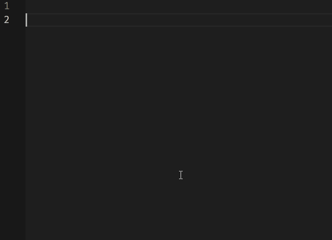

# IMPORTANT NOTE
> I have finally completed a total re-write of this extension which was long overdue. The extension has now been split into 2 new extensions, `Project Notes` on [VSCode Marketplace](https://marketplace.visualstudio.com/items?itemName=willasm.pnotes) and on [Github](https://github.com/willasm/pnotes) and `Comment Highlighter` on [VSCode Marketplace](https://marketplace.visualstudio.com/items?itemName=willasm.comment-highlighter) and on [Github](https://github.com/willasm/comment-highlighter). The syntax highlighting was only intended to be a minor addition to the extension but it has grown to the point where it really needed be its own seperate extension. Seperating the old extension into two extensions allows me to focus exclusivly on each of the new extensions as needed. The old extension will remain available for those that wish to use it but it will only receive limited support for bug fixes if they are discovered.

> I recommend disabling or uninstalling this extension in favour of using the new extensions. They are not compatible with this older version and will cause issues if run simutaneously. If you only ever used the Project Notes feature, then you can just install the new `Project Notes` extension. Same goes for the `Comment Highlighter` extension.

The new extensions offer many new features...
- Project Notes - Filenames are now colored (User definable)
- Project Notes - Filenames can now be preceded with an icon (User Definable)
- Project Notes - Files can have a priority {1 to 5} with its own color and icon
- Comment Highlighter - Now has a Tag Browser panel
- Comment Highlighter - Selecting a tag in the Tag Browser will open that file and jump to the tag position
- Comment Highlighter - The files and tags in the Tag Browser are colored as well (User definable)
- And much more...

# Project Notes + TODO Highlighter

Maintains 2 lists of notes in markdown file format. Notes are either project specific or global. Local project notes are associated with the current project that is currently loaded while global notes are accessible at all times. Notes may be viewed in preview or edit modes. [Links](#using-file-links) to both project and global notes can be embedded within your source code.

Adds TODO syntax highlighting support to comments in your source files.

Note: This extension provides syntax highlighting for definable keywords within your source code. The highlighting is enabled by file extension. It has support for the following languages by file extension...

`.asm .bas .bat .c .c++ .cc .cls .cmd .coffee .cp .cpp .cppm .cs .css .cxx .dpr .go .html .ini .ixx .java .js .jsonc .jsx .kt .kts .ktm .less .m .mat .md .pas .pl .php .py .r .rlib .rs .rb .scss .sql .swift .tbs .ts .twig .txs .vue`

It is possible to [add new extensions](SETTINGS.md) to the settings file. If you are using a programming language that this extension does not support and you need assistance adding it to the settings file, please submit an issue on my [Github Issues page](https://github.com/willasm/project-notes/issues) and I will add support for it to this extension.

## Features
- Maintains 2 lists of notes, one project specific and one global.
- Insert Links to project note files inside your codes comments.
- Insert Links to global note files inside your codes comments.
- Local notes folder name is user definable, (defaults to `.pnotes`).
- Global notes location can be set to any preferred location (uses `.pnotes` folder in the current users home folder by default).
- Adds syntax highlighting in comments to the default tags `BUG, CHANGED, DEBUG, FIXME, HACK, IDEA, NOTE, OPTIMIZE, RESEARCH, REVIEW, TEMP and TODO`.
- New `Tags` can be added to the settings file.
- Supports Light and Dark Themes.
- All `Tags` can be enabled or disabled individually in the [settings](SETTINGS.md) file.
- Highlighting of user definable `Tag Blocks` - Any text surrounded by user definable text characters.
- [Snippets](#snippets-for-tags) for the pre-defined tags and tag blocks.
- `Tags` are case insensitive.
- `Tags` trailing colon is optional.
- `Parentheses`, `brackets` and `Curly braces` in comments are also highlighed. (Can be individually disabled in the settings file).
- `Backticks`, `"Double Quotes"` and `'Single Quotes'` in comments are also highlighted. (Can be individually disabled in the settings file).

## Screenshots
Project and Global Note Views....


Example Highlighting Dark Theme (Dark+ default dark)....


Example Highlighting Light Theme (Light+ default light) ....


## Extension Commands
These commands are availiable from the command pallette: (Windows: CTRL+Shift+P or F1) (Mac: CMD+Shift+P)

- `Project Notes: Open Note File Link`

    Opens a Project or Global Note File from a Comment File Link. [See Using File Links](#using-file-links)

- `Project Notes: Set Globals Notes Folder Location`

    Set Globals Notes Folder Location. Defaults to `.pnotes` folder in the current users home folder.

- `Project Notes: Set Local Notes Folder Name`

    Set Local Notes Folder Name. Defaults to `.pnotes` but can be changed with this command.

- `Project Notes: Edit Tags Settings File`

    Opens Settings File for editing.

- `Project Notes: Restore Tag Settings File`

    Restores settings file to its default settings. (Caution! This will remove all changes you have made!)

Note: This extension does not set any default key bindings for any of these commands. Setting one for the command `Project Notes: Open Note File Link` is recommended if you plan to use that feature frequently.


## Using File Links
Create a comment in the format `// Project File: Filename.md` for project notes. The `Project File:` portion is the trigger for highlighting the following file name.

Create a comment in the format `// Global File: Filename.md` for global notes. The `Global File:` portion is the trigger for highlighting the following file name.

[Snippets](#snippets-for-tags) are included for inserting both types of note links.

Note that the `md` extension is required. The file name is styled as underlined by default. Note that it is not an actual clickable link. Unfortunatly it is not currently possible to receive mouse click messages from vscode.

To create (or open an existing project note) simply run the command `Project Notes: Open Note File Link` with the cursor anywhere on the same line as the `Project File: Filename.md` comment. If the file already exists it will be opened in a new editor window, otherwise a new file with the supplied name is created and opened for editing.

To create (or open an existing global note) simply run the command `Project Notes: Open Note File Link` with the cursor anywhere on the same line as the `Global File: Filename.md` comment. If the file already exists it will be opened in a new editor window, otherwise a new file with the supplied name is created and opened for editing.

All local Project Note Files are stored in the `.pnotes` folder (by default) which is created if it does not exist. You may want to add to your `.gitignore` file `.pnotes/*.md` if you do not want Git to track your notes. If you wish to hide this folder from the explorer view you can by adding it to the `files:exclude` section in the settings.

## Changing TAG Colors and Styling

Refer to the [settings file documentation](SETTINGS.md)

## Snippets for tags
Snippets are provided for the pre-defined tags. They can be entered by typing the prefixes...

- `tagKeyword`
- `tagProjectNote`
- `tagGlobalNote`
- `tagMainTitle`
- `tagSubTitle`
- `tagHiddenTitle`
- `tagUnderline`
- `tagStrikethrough`
- `commentHiddenTitle`
- `commentKeyword`
- `commentBoxSingleLine`
- `commentBoxDblLine`

Note: To enable snippets selection menu in comments, add this to your settings.json file.
```
  "editor.quickSuggestions": {
    "comments": true
  },
```

### How to use the snippets...



### More examples of how to use...


## Release Notes
See the [Release Notes](RELEASE.md) for details.

