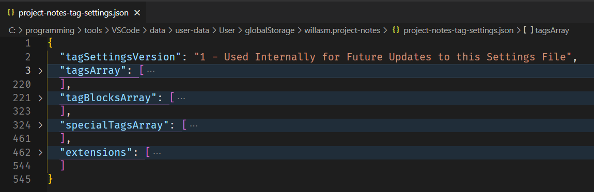
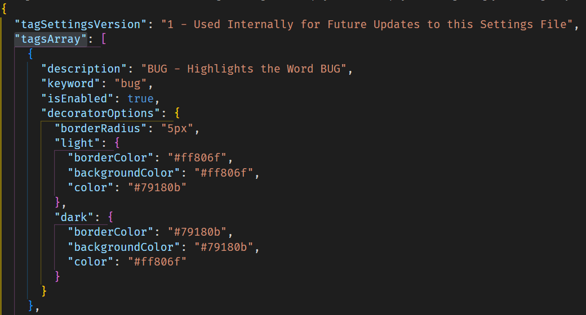
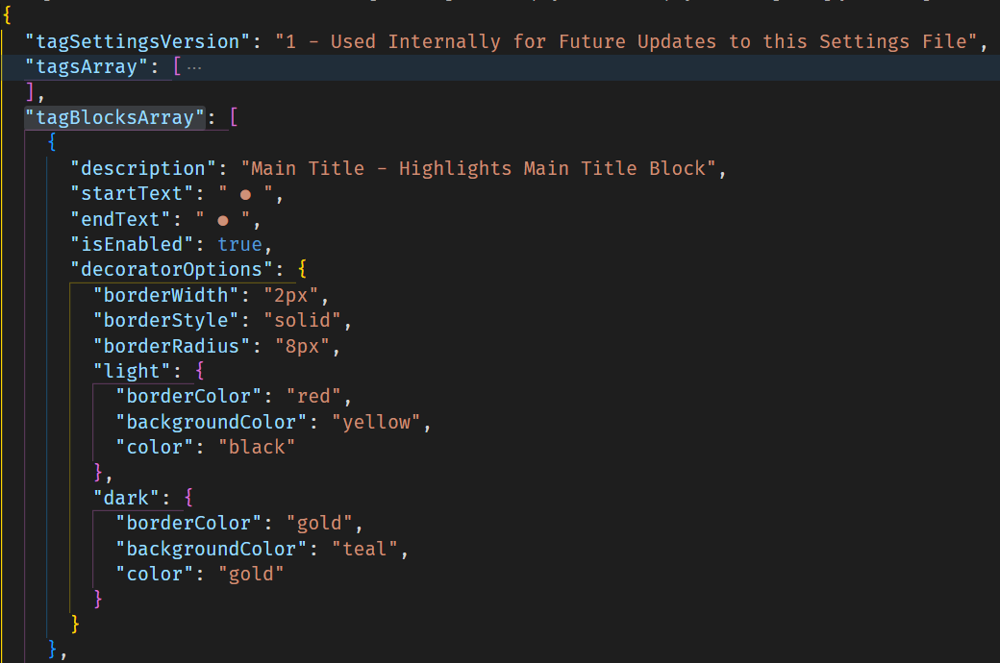
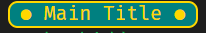
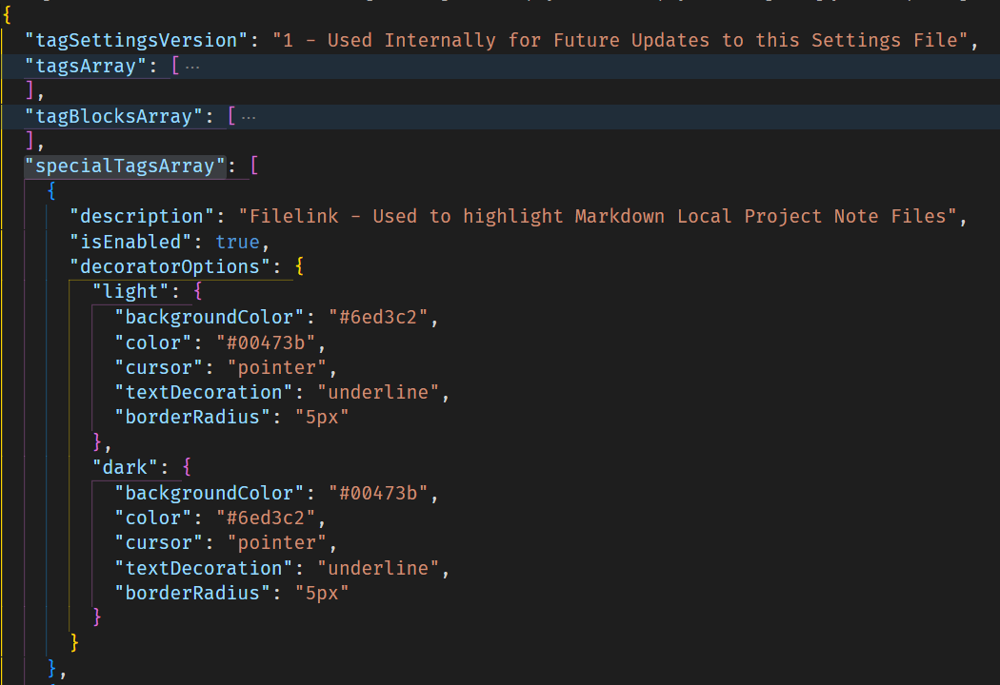
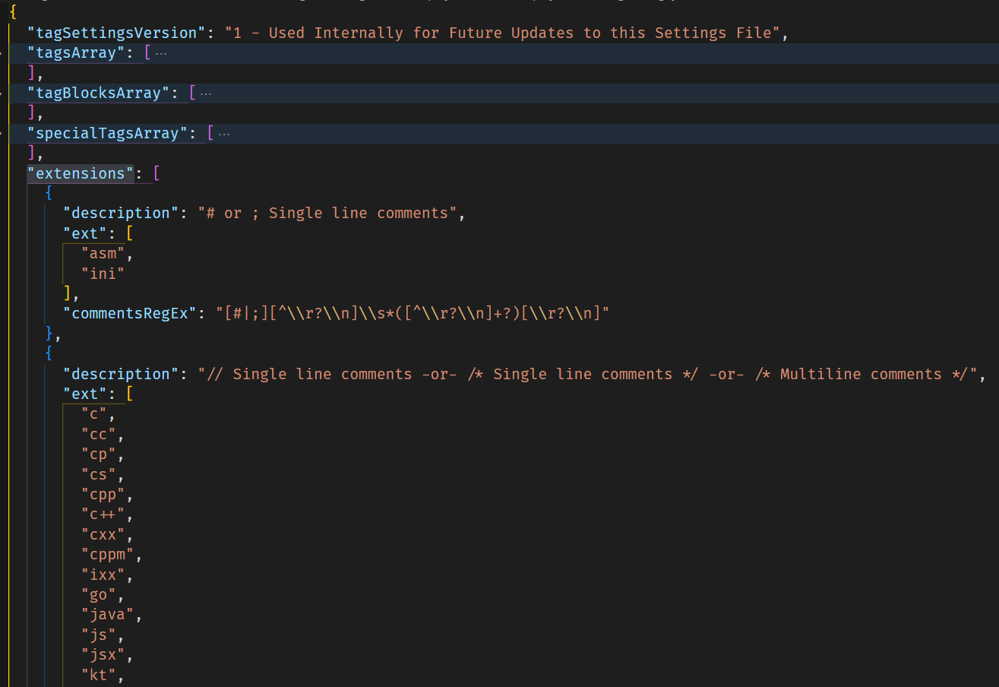

# Project Notes + TODO Highlighter Settings File

## project-notes-tag-settings.json

All tag settings are stored in this file which can be opened for editing with the command `Project Notes: Edit Tags Settings File`. The root contains the following entries...

## Json Root

### "tagSettingsVersion"
Used internally by the extension for any future updates to the default settings. Do Not modify this string.

### "tagsArray"
This is the array which contains all the default tags. This is the array to modify if you wish to add a new keyword, disable/enable existing keywords, modify keyword colors and styling etc. If you wish to add a new keyword the easiest way is to copy and paste an existing entry. Just remember to add the comma seperating the objects. Here is an example entry...

#### tagsArray Object

##### "description"
Brief description of the tag object. Not actually used by the extension, it is just there to describe the object.

##### "keyword"
This is the actual tag word that will be be highlighted, (bug) in the screenshot. If you are adding a new keyword I suggest not using common words or you will end up highlighting more than you expected. You can also change this string to a new keyword if you do not use the default keyword.

##### "isEnabled"
Boolean value of true (enabled) or false (disabled). While you could simply delete an entry entirely it is preferable to set this entry to false to disable it.

##### "decoratorOptions"
This is where you provide all the colors and styling to be applied to the keyword. In the screenshot "borderRadius" is what provides the rounded corners of the background. The "light" and "dark" objects contain entries which are specific to those theme types.
 - "borderColor" sets the border color.
 - "backgroundColor" sets the background color. Note: you can set this to an empty string "" or simply delete the key/value pair to remove the background color.
 - "color" the color for the text itself.

 Please refer to these sites for more information on rendering options...

[VSCode API Decoration Render Options Reference](https://code.visualstudio.com/api/references/vscode-api#DecorationRenderOptions)

[vshaxe.github.io Decoration Render Options Reference](https://vshaxe.github.io/vscode-extern/vscode/DecorationRenderOptions.html)

### "tagBlocksArray"
This is the array which contains all the tag blocks. `Tag Blocks` allow you to highlight any selection of text between a defined starting string and an ending string. These are used quite extensivly in the screenshots in the [Readme](README.md) file. New entries can be added here or the existing ones can be modified for your own personal use. I recommend not using common keyboard symbols as you will end up highlighting more text than you planned to. My suggestion is to use Character Map (windows) or similar tool and and use non keyboard charcters or seldom used characters from the font you use in vscode as starting and ending strings. While this prevents quick entry from the keyboard you can easily add them to a snippet and enter them that way. I have provided snippets for the pre-defined tag blocks already. Here is an example entry..

#### tagBlocksArray Object

Example of the result of this definition...

#### "Main Title - Highlights Main Title Block"

### "specialTagsArray"
This is the array which contains all the unique tags. This includes definitions for `Project File Links`, `Global File Links`, `Parentheses`, `Curly Braces`, `Brackets`, `Backticks`, `Double Quotes`, and `Single Quotes`. Note: You can -Not- add new entries here as each item is handled differently in the code of the extension. However, feel free to enable/disable or change the colors and styling of the individual items as you wish. If you would like to see something added here, please feel free to make a suggestion on my [Github Issues page](https://github.com/willasm/project-notes/issues). Here is an example entry...

#### specialTagsArray Object

### "extensions"
This is the array which contains all the supported file extensions of this extension. These objects provide the Regular Expression to search the code for comments. If you want to add a file extension, first check the "description" key of the existing entries to see if your languages comments definition matches one of the existing ones. If it does then you simply have to add the extension text to the "ext" key. Otherwise you will need to add a new extension object. I like to use [https://regex101.com/](https://regex101.com/) for creating and testing my Regular Expressions. Note that when adding an expression value to the "commentsRegEx" key you need to escape any backslashes (\s needs to be \\\\s) or vscode will not read it in properly. If you need assistance adding a new languages extension please submit a request to my [Github Issues page](https://github.com/willasm/project-notes/issues) and I will add it to the settings file. Here is an example entry...

#### extensions Object

## That is it for the Settings
I hope you enjoy using this extension! Feel free to leave any comments, questions or suggestions on either my [Github Issues page](https://github.com/willasm/project-notes/issues) or my [VSCode Marketplace page](https://marketplace.visualstudio.com/items?itemName=willasm.project-notes)

Thank you, William McKeever.
